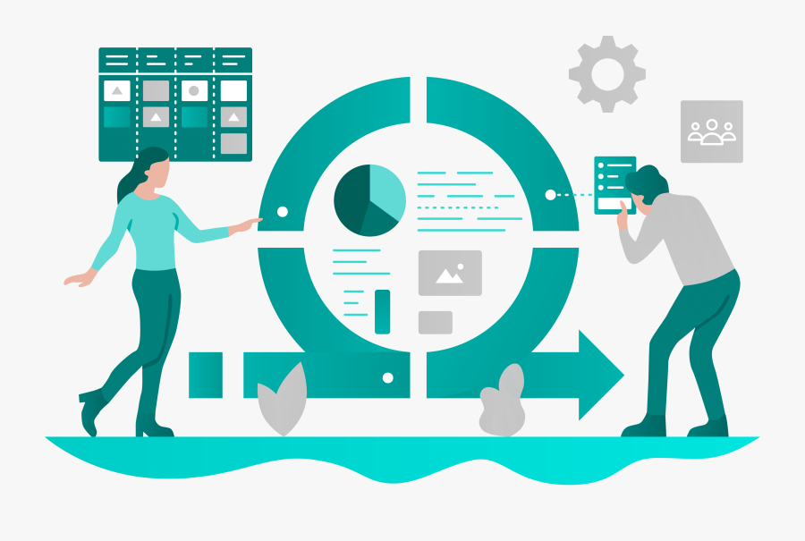
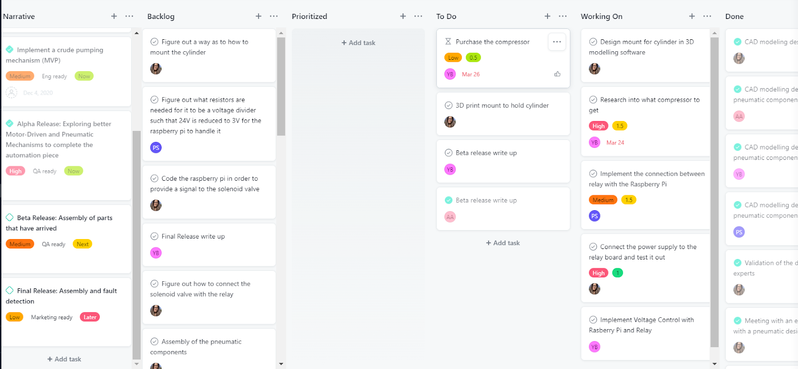
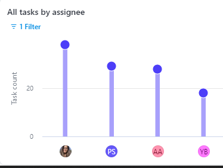

### Page Index
- [Executive Summary](#executive-summary)
- [Design Architecture](design-architecture)
- [Product Implementation](#product-implementation)
- [Solution Architecture](#solution-architecture)
    + [Architecture Diagram](#architecture-diagram)
    + [System State(s) Diagram](#system-states-diagram)
    + [Solution Sequence Diagram](#solution-sequence-diagram)
    
    
      
    
### Executive Summary

The Covid-19 Pandemic has highlighted challenges in getting immediate access to ventilators or resuscitators especially for patients needing to be transported between medical facilities while experiencing hypoxia. 
We learnt from our Stakeholders, doctors in Gujarat, India that in such scenarios the patient is manually ventilated using a BVM by ambulance personnel. These medical personnel can often be understaffed and overworked. Pumping a BVM for journeys of upto an hour pulls them away from other aspects of critical patient care, increasing fatigue and chances of  human error. 
We as a team decided to tackle this challenge by designing an automated BVM pumping mechanism that is cost-effective, compact, lightweight and robust. As strong advocates for echo-sustainability we were motivated to devise a solution which could reuse a lot of existing technology. Hence, the design showcased below will be an automated version of pre-existing and readily available medical resources with better assistive and failure detection features, making it a creative bio-tech solution. 
Initially, leading up to the MVP after rigorous research and discussions with our Stakeholders we decided to attempt a solution which was similar to the ones tested in the industry, aka a motor driven pumping mechanism. We implemented this by refurbishing an unused 3D printer but we realized that the structure was quite bulky, intrusive, more suitable for bedside use, unable to compress the BVM sufficiently. We also found that most  of the other potential solutions were built around this mechanism. For our final product, we wanted the design to add minimal structural overhead and spatial inconvenience to the paramedics, patients and accompanying kin. 
On exploring different design avenues, keeping our requirements in mind, we deduced that the Pneumatic Design was the best fit for our use case. We consulted with different industry experts who suggested Festo as the leading manufactures in the field. This design choice helped us make a unique, eco-friendly, portable and a compact design such that it could be easily embedded in an ambulance environment.

<h4> So what does our Product Do? </h4>
Our product as-is meets all the criterias that we set out to achieve, they were decided on the basis of extensive research and stakeholder feedback. While remodeling our MVP design the following goals and requirements were concluded upon for the final product:
<ul>
  <li>
Readily Sourced and Repairable: Each component used in making the automation mechanism is easily detachable and replaceable. The product facilitates manual pumping incase of a failure as a result of the aforementioned attributes. Most of our components have a Matrix Code which upon scanning directs the user to technical documentation corresponding to that component. The air tubing used can be detached from push in fittings by pressing down on them, allowing for modification in their length and substitution.
</li>
<li>
No damage to the BVM: There is little to no scope of damaging the BVM by implementing our design as it accounts for a cushioning material placed on the piston end (by adding a sponge for the current design and a cushion to the metallic concave plate). The direction of motion in which the bag is mechanically pushed is in line with it’s orientation and the axis of the arm that it’s mounted on. 
Programmable: Our pumping mechanism is driven by an easily programmable microcontroller(Raspberry Pi) which gives us the ability to adjust or modify the pump rate as required (pump rate is usually constant across patients experiencing hypoxia as mentioned by our stakeholder). We are currently pumping the bag at 14 breaths/min which is the average desired pump rate. The PLC also reads sensor data and transmits it to the target medical facility as described by Siddharth Bhardwaj in his piece. (Link Sid’s work here)
Affordable: As we are reusing readily available pre-existing mechanisms, we have reduced the overall cost of the automating aspects of our device. Furthermore, most medical centres (including small remote ones) and ambulances carry BVMs on-site, in our target communities. Ambulances tend to have inbuilt air compressors onboard which simplifies the installation of our design further and makes it more cost effective. 
</li>
<li>
Power Requirement: Currently our system draws 24V*0.067A = 1.608W when the piston is extended and 24*0.005= 0.12W when retracted. This is sufficient power to compress the BVM all the way if a minimum pressure of 30 psi is provided.
</li>
<li>
Sustainable design: The global pandemic brought about some unique component procurement challenges to light for our team. Due to the inaccessibility of the electronics labs and machine shop we had to struggle a lot while trying to complete the simplest of tasks at home. This presented an opportunity for the team to actively think of repurposing certain components like a cardboard holder fashioned to mount the pneumatic cylinder, a wooden box to mount and hold all our pneumatic components and the BVM. We also used a sponge to cushion our piston’s head such that it wouldn’t puncture the BVM. 
</li>
<li>
Portability: Our current design is portable and light-weight. It is designed to afford compactness such that it requires minimal space on board the ambulance. We decoupled elements of the automation mechanism into stationary and dynamic parts. Only the pneumatic cylinder and BVM will be in close proximity to the patient, whereas, the rest of the elements will be positioned at a fixed location most suitable to the ambulance infrastructure. 
</li>
<li>
Size: Decoupling various subfunctions of our mechanism helped us  make the size smaller and the setup less intrusive.
</li>
<li>
Compression: The current implementation affords complete compression of the self-inflating bag by meeting the minimum thrust requirements. Complete compression ensures sufficient oxygen/air reaches the patient’s lungs.
</li>
</ul>

***
###  Design Architecture
 
***
###  Design Implementation ---Video
***

### Project Management 

Although we are an agile team, for the winter semester we modified our project management style, using a waterfall-agile hybrid approach for the alpha release, and an agile approach for the beta and final release.  
The alpha release consisted of researching and designing the mechanism that would pump the BVM.  The research was done with specially designated research sprints, while the design was done through consultation with advisors.  
Details of the alpha release roadmap can be found here. 

Here is a snapshot of the Alpha release Sprint Planning board:

The beta release had to be modified due to delays in the shipments of parts. The original beta release plan entailed completing the assembly of the device. This was changed to completing the design of the parts that had arrived by the beta release deadline: the Rasberry Pi, and the RPi Relay board.  Additionally it included designing and 3D printing the mount for the Cylinder which compressed the bag.  We formulated sprints to complete these tasks, and allocated the tasks according to team members availability and skill sets.  
Details of the beta release roadmap can be found here. 

Here is a snapshot of the Beta release Sprint Planning board:

The final release consisted of assembling and testing out the final design.  Once we received the parts, we ran a sprint to allocate assignments for each task.  
Here is a snapshot of the final release Sprint Planning board:

Work Distribution
Creating an even work distribution was one of the challenges of the capstone project. Although we had strategies that helped balance out the work somewhat ultimately at different points in the project the work distribution was skewed/non-uniform. We used an agile project management style. The assigned product owner created tasks on the asana and the scrum master assigned the task according to the team members' access to resources in terms of access to the advisors,communication with stakeholders and physical access to the components of the product. 

Since the assembly could only be done in one household and congregating to assemble the parts was not possible due to COVID-19 restrictions, the responsibility of assembling the parts would often fall on one group member.  This happened for both the MVP and the final product assembly, and made it very challenging for group members to do work concurrently.  To support the group members doing assembly, other group members would take on other responsibilities, such as buying and delivering various components for the product.  We would also occasionally ferry the parts back and forth between households, according to the availability of each team member. For example, the electrical components for the final design were assembled at one house, while the final assembly took place at another.   In an ideal world it would be possible for each group member to have their own prototype to work on, or it would be possible to work together on one prototype in one location.  Unfortunately fate was not on our side in this regard.  
Work distribution breakdown: (Not perfectly to scale but provide a rough estimate for the work distribution)

***

### Financial Management 

The final cost was $695.59 including the cost of the air compressor, which 108 ambulances are quite often equipped with.  Without the air compressor this could be reduced to $520.46, which in our estimation is a more fair estimation of the cost of our product. 
Our original design included multiple components that we did not include in the final design because we were afraid of going over the budget.  The original price for all the components of the pumping mechanism was $1047.95, well over the $800 budget.  
The reason for this discrepancy was the difference between the final cost of the pneumatic components ($522.94) and the initial cost of the pneumatic components ($876.30). This amounted to a $352.36 difference, enough to bring the full cost under the budgetary requirement ($800 for the pumping component  of the capstone project).  
There were two main areas where we found cost savings.  
Firstly, the pressure sensor on the original air prep unit was removed.  The Applications Engineer at Festo advised that although the pressure sensor could be useful for fault detection, it was not essential for the more crucial pumping functionality of the automatic BVM, and therefore not required for our design. Additionally, it was noted that it could easily be added on afterwards if the budget allowed for it. 
Secondly, the original Cylinder included a specially manufactured rectangular plate which included a cushion that would evenly distribute the force over the surface of the BVM causing smooth pumping and doing no damage to the self inflating bag.  This cylinder was replaced by a round, more cost effective one.  In order to emulate the cushioning effect that the original cylinder came with, we attached a sponge to the head of the piston, at no additional cost, and quite similar functionality.  
Together, these two items added up to $352.36.  The lesson learned from this was that when developing a low cost mechanism, it is important to only include items that are absolutely essential, and to attempt to find substitutes wherever possible. 
We saved money by either borrowing or recycling components as much as possible.  
In our final submission, all non-pneumatic components (with the exception of the relay board) were either borrowed or recycled, including the power supply, breadboard, Raspberry Pi. The cost of each of these devices is unknown, but it would be reasonable to assume some of these components like the power supply would be provided by the ambulance.  The Raspberry Pi would increase the cost of the device by $47.45 if it was purchased brand new.  However the Raspberry Pi is only needed for prototyping, as the programmed microcontroller is the only component needed for a mass produced design. This would not significantly increase the overall cost of each device. 
We believe that the job we did saving money was quite admirable.  Although our device cost about $ $695.59, this number could be reduced to $520.46 when one factors in that many of the 108 ambulances that our product was designed for include air compressors (ours cost $175.13.)
This  price could potentially be further reduced when one considers that when parts are bought in bulk for mass production, they are sold for less.  Having our device be low cost was one of the key goals for our project and we believe we have met that at $520.46 we have met that requirement.  

Link to team expenses document:
https://docs.google.com/spreadsheets/d/1CPhQy4uPNchHIrxZJhlksTB_un8ZhwJPs0NymQpLDPM/edit#gid=0
Original cost of pneumatic components:
https://docs.google.com/document/d/1FXZbaBwHJNdu3NB8xzcIHxG4ReOM9Sst7z263wTPhvk/edit?usp=sharing
Updated cost of pneumatic components:
https://docs.google.com/document/d/14mnJ_hAVgQfS5SkhmXBm52U9W-7HVQDcIqaKVMDcAnI/edit?usp=sharing

### Lesson Learned/Reflection

#### Jonathan Blumenfled

Early in the capstone project, our group had to decide between doing a software project and a biomechanical project.  We are a team of software and mechanical engineers, so the software project seemed like the obvious choice.  We elected however to go with the medical (automated BVM) project, as its objective resonated with us on a more personal level.
This led to a few challenges.  
Due to Covid, it was difficult to collaborate and work with each other remotely, and it was difficult to obtain parts in a timely fashion.  There was also a large learning curve in understanding mechanical engineering concepts and softwares such as solidworks. Despite these challenges, I am happy I chose a mechanical engineering project.  I learned through the challenges, that things worth doing are often challenging, and in many ways, I learned more from leaving my comfort zone than I would have had I done a software engineering project.  For example, the fact that our group had to meticulously plan out all of our sprints to do mechanical engineering and health related research, made it that we sharpened our project management skills significantly, so as not to lose any time.  Had we been more familiar with the type of work we would be doing, it is possible we would have rushed into the implementation phase without the same attention to detail for the design and requirements of our product.  
If I could advise myself in September would be to worry less about the final product and focus more on the learning journey, as what matters most is what you learn along the way, more so than how souped up your final product is. 
On a more practical level, I would advise myself to get in contact with mechanical engineering experts as early as possible, as they proved to be crucial resources.  Also, I would advise myself to get to ordering parts as early as possible, we did not anticipate the impact shipment delays had on our ability to complete the project in a timely manner.

### References

Icons made by <a href="https://www.flaticon.com/authors/wanicon" title="wanicon">wanicon</a> from <a href="https://www.flaticon.com/" title="Flaticon">www.flaticon.com</a>

Icons made by <a href="https://www.freepik.com" title="Freepik">Freepik</a> from <a href="https://www.flaticon.com/" title="Flaticon">www.flaticon.com</a>

Icons made by <a href="https://www.flaticon.com/authors/flat-icons" title="Flat Icons">Flat Icons</a> from <a href="https://www.flaticon.com/" title="Flaticon">www.flaticon.com</a>

