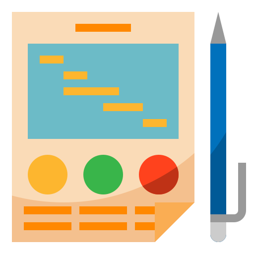
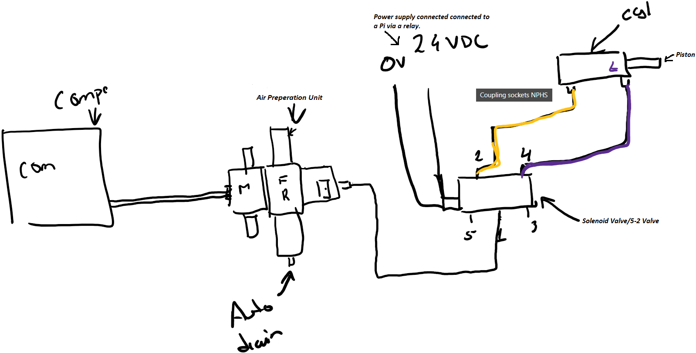
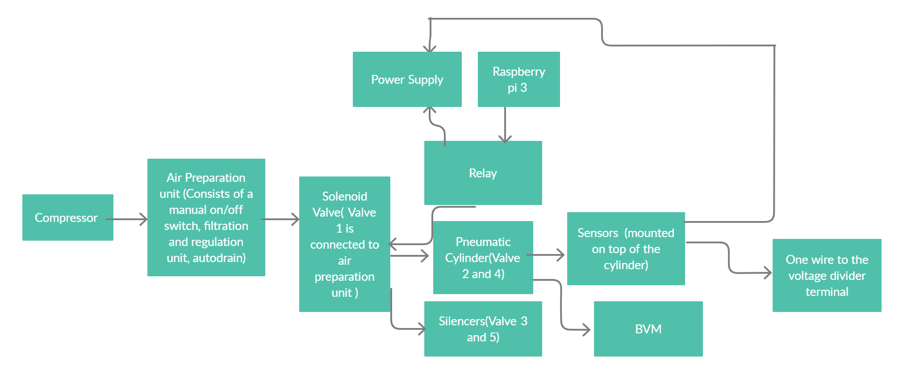
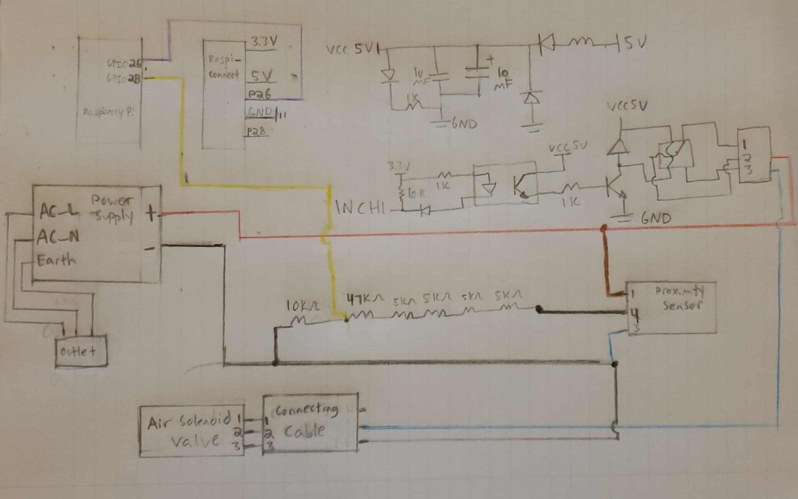
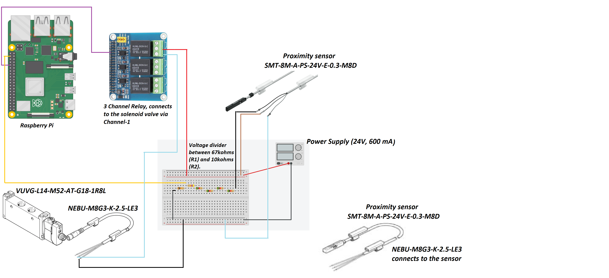
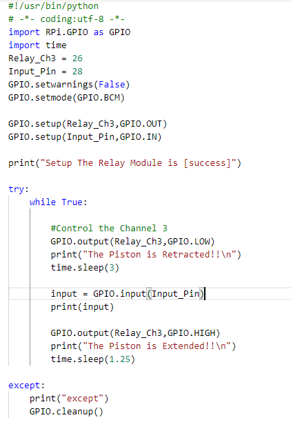
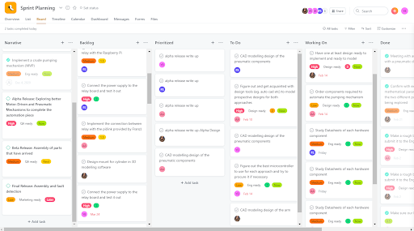
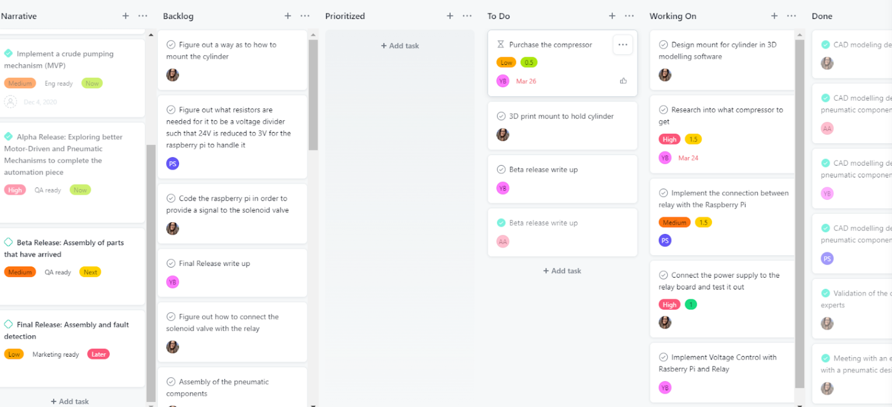
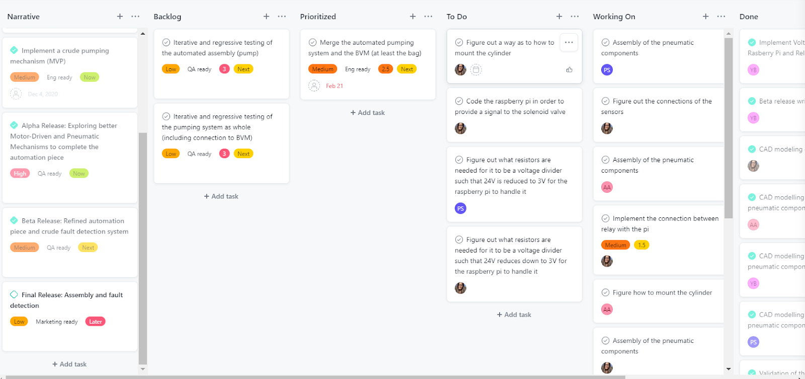

### Page Index
- [Executive Summary](#executive-summary)
- [Design Architecture](#design-architecture)
    * [Pneumatic System as Built](#pneumatic-system-as-built)
        + [Block diagram of the Pneumatic Pumping mechanism](#block-diagram-of-the-pneumatic-pumping-mechanism)
        + [Mechanical Diagram of the Pneumatic Pumping mechanism](#mechanical-diagram-of-the-pneumatic-pumping-mechanism)

    * [Electronic and Software system as Built](#electronic-and-software-system-as-built)
        + [Schematic diagram of the Electrical Components of the Pneumatic Pumping mechanism](#schematic-diagram-of-the-electrical-components-of-the-pneumatic-pumping-mechanism)
        + [Electrical diagram of the Pneumatic Pumping mechanism](#electrical-diagram-of-the-pneumatic-pumping-mechanism)
    * [Code](#code)
- [Design Implementation](#design-implementation)
- [Performance Analysis](#performance-analysis)
- [Where would our project go next](#where-would-our-project-go-next)
- [Project Management](#project-management)
    * [Work Distribution](#work-distribution)
- [Financial Management](#financial-management)
- [Reflection](#reflection)
    * [Jonathan Blumenfeld](#jonathan-blumenfeld)
    * [Shivani Joshi](#shivani-joshi)
    * [Priyam Shah](#priyam-shah)
    * [Areeba Abidi](#areeba-abidi)
- [Acknowledgement and Appreciation](#acknowledgment-and-appreciation)
- [References](#references)
    
     
     
    

  

### Executive Summary

The Covid-19 Pandemic has highlighted challenges in getting immediate access to ventilators or resuscitators especially for patients needing to be transported between medical facilities while experiencing hypoxia. We learnt from our Stakeholders, doctors in Gujarat, India that in such scenarios the patient is manually ventilated using a BVM by ambulance personnel. These medical personnel can often be understaffed and overworked. Pumping a BVM for journeys of upto an hour pulls them away from other aspects of critical patient care, increasing fatigue and chances of  human error. 

We as a team decided to tackle this challenge by designing an automated BVM pumping mechanism that is cost-effective, compact, lightweight and robust. As strong advocates for echo-sustainability we were motivated to devise a solution which could reuse a lot of existing technology. Hence, the design showcased below will be an automated version of pre-existing and readily available medical resources with better assistive and failure detection features, making it a creative bio-tech solution.

Initially, leading up to the MVP after rigorous research and discussions with our Stakeholders we decided to attempt a solution which was similar to the ones tested in the industry, aka a motor driven pumping mechanism. We implemented this by refurbishing an unused 3D printer but we realized that the structure was quite bulky, intrusive, more suitable for bedside use, and was unable to compress the BVM sufficiently. We also found that most of the other potential solutions were built around this mechanism. So for our final product, we wanted the design to add minimal structural overhead and spatial inconvenience to the paramedics, patients and accompanying kin. 

On exploring different design avenues, keeping our requirements in mind, we deduced that the Pneumatic Design was the best fit for our use case. We consulted with different industry experts who suggested Festo as the leading manufactures in the field. This design choice helped us make a unique, eco-friendly, portable and compact design such that it could be easily embedded in an ambulance environment.

<h4> So what does our Product Do? </h4>

Our product as-is meets all the criterias that we set out to achieve, they were decided on the basis of extensive research and stakeholder feedback. While remodeling our MVP design the following goals and requirements were concluded upon for the final product:

<ul>
<li>
Readily Sourced and Repairable: Each component used in making the automation mechanism is easily detachable and replaceable. The product facilitates manual pumping incase of a failure as a result of the aforementioned attributes. Most of our components have a Matrix Code which upon scanning directs the user to a technical documentation corresponding to that component. The air tubing used can be detached from push in fittings by pressing down on them, allowing for modification in their length and substitution.
</li>
<li>
No damage to the BVM: There is little to no scope of damaging the BVM by implementing our design as it accounts for a cushioning material placed on the piston end (by adding a sponge for the current design and a cushion to the metallic concave plate). The direction of motion in which the bag is mechanically pushed is in line with it’s orientation and the axis of the arm that it’s mounted on. 
Programmable: Our pumping mechanism is driven by an easily programmable microcontroller(Raspberry Pi) which gives us the ability to adjust or modify the pump rate as required (pump rate is usually constant across patients experiencing hypoxia as mentioned by our stakeholder). We are currently pumping the bag at 14 breaths/min which is the average desired pump rate. The PLC also reads sensor data and transmits it to the target medical facility as described by Siddharth Bhardwaj in his piece. (Link Sid’s work here)
Affordable: As we are reusing readily available pre-existing mechanisms, we have reduced the overall cost of the automating aspects of our device. Furthermore, most medical centres (including small remote ones) and ambulances carry BVMs on-site, in our target communities. Ambulances tend to have inbuilt air compressors onboard which simplifies the installation of our design further and makes it more cost effective. 
</li>
<li>
Power Requirement: Currently our system draws 24V*0.067A = 1.608W when the piston is extended and 24*0.005= 0.12W when retracted. This is sufficient power to compress the BVM all the way if a minimum pressure of 30 psi is provided.
</li>
<li>
Sustainable design: The global pandemic brought about some unique component procurement challenges to light for our team. Due to the inaccessibility of the electronics labs and machine shop we had to struggle a lot while trying to complete the simplest of tasks at home. This presented an opportunity for the team to actively think of repurposing certain components like a cardboard holder fashioned to mount the pneumatic cylinder, a wooden box to mount and hold all our pneumatic components and the BVM. We also used a sponge to cushion our piston’s head such that it wouldn’t puncture the BVM. 
</li>
<li>
Portability: Our current design is portable and light-weight. It is designed to afford compactness such that it requires minimal space on board the ambulance. We decoupled elements of the automation mechanism into stationary and dynamic parts. Only the pneumatic cylinder and BVM will be in close proximity to the patient, whereas, the rest of the elements will be positioned at a fixed location most suitable to the ambulance infrastructure. 
</li>
<li>
Size: Decoupling various subfunctions of our mechanism helped us  make the size smaller and the setup less intrusive.
</li>
<li>
Compression: The current implementation affords complete compression of the self-inflating bag by meeting the minimum thrust requirements. Complete compression ensures sufficient oxygen/air reaches the patient’s lungs.
</li>
</ul>

***

 

### Design Architecture

#### Pneumatic System-as-Built: 

<ul>
<li>
Air Compressor: Will be able to compress air upto 100psi and contain an inbuilt air reservoir such that the compressor does not run all the time, we recognize that they can be loud if kept running for long periods of time which could discomfort patients. The volume of the reservoir we can include for our POC will depend on our budget constraints for the time being.Currently for our design we are setting the minimum psi to be 80.
</li>
<li>
Air Preparation Unit (MSB4-1/4:C4:J2-WP): This component has a filter at the bottom that separates excess dust or moisture coming in from the compressed air and drains these substances out from the auto drain attached. The top piece is the pressure regulator, it has a dial that allows us to configure the air pressure we wish to supply to the solenoid valve. The air prep unit was added to ensure the air being used was getting filtered before being supplied to the solenoid valve as moisture can wash away grease applied to the solenoid and within the cylinder rendering them unable to move. Sand and dust particles can also clog the valve as it requires 40 micron filtration. The auto drain will require periodic inspection(we suspect once a month) by ambulance staff to ensure it is not getting clogged and functional. Lastly a manual switch that allows us the ability to cut our air flow from the compressor to the rest of the components. We were planning on adding a pressure sensor here that would allow us to ensure the air compressor was functioning properly and that there were no clogs in the filter/regulator section that were causing the air pressure to drop, however, due to a budget crunch we decided to move forward with our POC without it.
</li>
<li>
Solenoid Valve/5-2 Valve (VUVG-L14-M52-AT-G18-1R8L): This is a single coil valve that has 5 ports on it. The main air goes into this valve via port 1 as can be seen in the image above and flows out via ports 2 and 4 depending on whether 0 or 24V signal is being received (respectively). 
</li>
<li>
Pneumatic Cylinder (DSNU-25-100-PPS-A): Connects to ports 2 and 4 of the solenoid valve and based on the air flow the piston in the cylinder either releases or retracts. This cylinder has a stroke of 100mm and is about 250mm in length. 2 sensors were mounted on the cylinder that check whether the piston is being deployed and retracted fully within a certain time frame, if not we can flag that as an error scenario which can then be troubleshooted to determine where the fault lies within the system.
    </li>
<li>
Couplings used to connect different components:
    </li>
<ul>
    <li>
Male coupler- AD-1/4NPT-G1/4-I Adapter - QS-G1/4-6: connects the air compressor to the air preparation unit via PUN-H-6X1-BL tubing 
</li>
<li>
QS-G1/4-6: connects the air preparation unit to the air compressor via PUN-H-6X1-BL tubing 
</li>
<li>   
QS-G1/4-6: connects the air preparation unit to the solenoid via PUN-H-6X1-BL tubing    
</li>
<li>
QS-G1/8-6: connects valve 1 of the solenoid to the air preparation unit via PUN-H-6X1-BL tubing
</li>
<li>
QS-G1/8-6: connects valve 2 of the solenoid valve to the GRLA-1/8-QS-6-RS-D connected to the back end of the pneumatic cylinder via PUN-H-6X1-BL tubing
</li>
<li>
QS-G1/8-6: connects the valve 4 of the solenoid valve to the GRLA-1/8-QS-6-RS-D connected to the front end of the  pneumatic cylinder via PUN-H-6X1-BL tubing
</li>
<li>
UC-⅛ : is a silencer on valve 3 of the solenoid
</li>
<li>
UC-⅛ : is a silencer on a valve 5 of the solenoid 
</li>
<li>
GRLA-1/8-QS-6-RS-D: connects the valve 4 of the solenoid valve to the back end of the pneumatic cylinder
</li>
<li>
GRLA-1/8-QS-6-RS-D: connects the valve 2 of the solenoid valve to the front end of the pneumatic cylinder
</li>
<li>
SMBR-8-25:mounts on the top of  the pneumatic cylinder to hold the sensor 
</li>
<li>
SMBR-8-25:mounts on the top of  the pneumatic cylinder to hold the sensor
    </li>
     </ul>
 
 <li>
We plan on placing the air prep unit and the solenoid valve together at a location that is yet to be determined based on where other medical equipment and the air compressor are situated in the ambulance. These components will be placed inside of a casing (open from the top and bottom), that is easily accessible incase maintenance is required. 
</li>
<li>
In trying to make our design portable we realized that making a compact carriabble ventilator would not be technically feasible because of special orientation requirements of the air prep unit (only ± 5°deflection from 90° allowed) so we opted to make a semi-portable design. Our design will be restricted to the ambulance but will allow the automated BVM pumping mechanism to be brought to a patient wherever they are situated, regardless of the height or placement of their bed. Our design does not require the medical professionals to provide extensions to the endotracheal tube or mask end, to connect with the BVM as we make sure our system enables all functionalities and conveniences a manual BVM provides. </li>  

#### Mechanical Diagram of the Pneumatic Pumping mechanism

#### Block diagram of the Pneumatic Pumping mechanism

</ul>

#### Electrical and Software System-as-Built: 
<ul>
<li>
Solenoid Valve/5-2 Valve (VUVG-L14-M52-AT-G18-1R8L): The solenoid’s power will switch between 24V and 0V based on the rate at which we need the cylinder to pump. For a rate of 14 breaths/min, 24V is supplied every 3s for 1s and 0V is supplied every 1s for 3s. The power signal will be regulated via a Raspberry Pi connected to a power supply via a relay.
</li>
<li>    
Proximity Sensor (SMT-8M-A-PS-24V-E-0.3-M8D): This sensor is mounted to the front of the pneumatic cylinder via a sensor holder. It has a small magnet that keeps a track of the piston motion. It is powered by a 24V signal and supplies a feedback signal of 24V back to the Raspberry Pi which is read via a GPIO (a voltage divider circuit is implemented to ensure we are only supplying 3.3V and under to the Pi). This sensor sends a digital true (1) if the piston is retracted, this is also signaled by an LED turning on.  
</li>
<li>    
Proximity Sensor (SMT-8M-A-PS-24V-E-0.3-M8D): This sensor is mounted to the back of the pneumatic cylinder via a sensor holder. It has a small magnet that keeps a track of the piston motion. It is powered by a 24V signal and supplies a feedback signal of 24V back to the Raspberry Pi which is read via a GPIO (a voltage divider circuit is implemented to ensure we are only supplying 3.1V to the Pi). This sensor sends a digital true (1) if the piston is extended, this is also signaled by an LED turning on. 
</li>
<li>
Couplings used to connect different components:
    </li>
<ul>
    <li>
NEBU-M8G3-K-2.5-LE3: This is the connector attached to a Solenoid Valve.This wire is connected on one end to the solenoid valve, the other end has 3 wires: black, blue and brown but only the blue and black ones are used.
        </li>
    <ul>
<li>
The blue wire is connected to GPIO pin 26 via the middle port and executes the switching mechanism between 24-0V. The first port is connected to 24V from the power supply to power the solenoid.
    </li>
<li>
The black wire is connected to the power supply ground.
    </li>
<li>
The brown wire is not connected to anything.
    </li>
        </ul>
<li>
    
NEBU-M8G3-K-2.5-LE3 (2 pieces): This is the connector attached to a Proximity Sensor.This wire is connected on one end to the sensor, the other end, has 3 exposed wires: black, blue and brown.
    </li>
    <ul>
<li>
The black wire is connected to the voltage divider terminal, a GPIO pin reads the output signal carried by the black wire (3.3V to signify 1 and 0V to signify 0).
    </li>
<li>
The blue wire is connected to the power supply ground.
    </li>
<li>
The brown wire is connected to 24V on the power supply, used to power the sensor.
    </li>
<li>
Voltage Divider Circuit: This connects sensor output to the Pi.The wire carrying an output signal of 24V is attached to one end of a 67 ㏀ resistors connected in series with a 10㏀ resistor. The midpoint of this series connection drops the input voltage to 3.1 V, making it tolerant by the GPIOs on a Pi. The other end of this divider is connected to the Power Supply ground.
  </li>
        </ul>
   </ul>     
<li>
   
Raspberry pi 4 Model b: This microcontroller is powered on with a power adapter (5V supply). The control code is written in a python script that runs on boot up. The code implements a switching mechanism for the solenoid. We switch between 24-0V at the rate of 14 breaths/min, the time intervals are mentioned in the[ code here.](images/diagrams/code.PNG) 
    </li>
<li>
    
Relay: The relay is mounted on the Raspberry Pi microcontroller. Relay can convert  higher current to a lower value or vice versa depending on the scenario. The relay facilitates two types of contacts: Open contact and close contact.Open contact is when the relay circuit is open and it does not receive any power and it switches to a close contact(when the relay receives power) due to the phenomenon of electromagnetism. The relay is connected to the power supply on port 2 of channel 3 and a GPIO 26 on port 1. We used a 3 channel relay where each channel has an input, output and ground terminals. 
</li>

#### Schematic diagram of the Electrical Components of the Pneumatic Pumping mechanism

#### Electrical diagram of the Pneumatic Pumping mechanism

</ul>

#### Code

### Performance Analysis

For our product to work as desired, the pneumatic components that draw power should be connected as mentioned above and powered on correctly. Once the circuits are made and pressurized air is provided, the piston will pump at 14 breaths/min. We ran several tests by modifying the periodic switching between 24-0V, successfully varying the pump rate between 12-20 breaths per minute. The duration of time the system is left running has little effect on the pump rate, deviation being ±1 breath/min. The 14 breaths/min were achieved by testing out different parameters for the time.sleep() function which is called twice, once during extension and again during retraction of the pneumatic cylinder piston, as seen in the code (images/diagrams/code.PNG)

The system is left running for about an hour to check for overheating and clogging, there were no anomalies in operation recorded. We did however note that a compressor that can pump upto 80psi would be sufficient as opposed to the max. 120psi one which has a large reservoir tank. The air compressor we connected to for testing had a holding capacity of 11.1L which proved to be quite small, leading to the compressor being turned on rather frequently(every 30 seconds). We noticed that with a pressure setting of 50psi, we were able to squeeze the bag a desirable amount but the pump rate reduced by a factor of -2 pumps/min. In order to achieve the 14 pumps/min rate we would have to tweek the time.sleep() parameters a bit but consuming air at a reduced pressure would increase the flow rate significantly, triggering the compressor to turn on every 10 seconds. However, in case of a loose connection or leakage low pressure air can do less physical harm whereas high pressure air reduces noise pollution but optimizes the air flow for the same pump rates. We wish to test this aspect further to strike a good balance between safety and efficiency.

We confirmed with our Stakeholders that the compression rate achieved and the amount of torque provided by the pneumatic cylinder while squeezing the BVM ensured enough oxygen supply reached the patient’s lungs. We demonstrated the amount of air being pumped by attaching a balloon on the end of the expiratory valve of the BVM. The balloon inflated to a diameter of 9cm when I squeezed it by hand thoroughly and about 7cm when pumped using the automation. This experiment suggests that manual pumping can be irregular and 
unregulated which could lead to internal damage but a regulated system with controlled pumping is desirable as it is safer to use. 

[Automated Pumping](https://www.youtube.com/watch?v=1stogvTAXRE&feature=youtu.be&ab_channel=AreebaAbidi) 

[Manual Pumping](https://www.youtube.com/watch?v=qQOZqJhlQgo&ab_channel=AreebaAbidi) 

We tried designing a barometer out of spare plastic tubing to compare the difference in the force distribution between the piston head being mounted by a cushion versus the metal head being exposed. We were unable to complete this test as our homemade barometer did not end up working, the tubing available to us was extremely short so everytime the BVM would be squeezed even by hand, the water would spout out (even though we tried adding very tiny amounts).

The patient’s safety, convenience and comfort have been the backbone principles driving our innovation so when it came to implementing and operating the electrical components, we were equally cautious. We checked the voltage and power threshold for each component and made sure to measure the voltage and current passing through them, using a multimeter, before the circuits were made, preventing a short circuit. 

### Where would our project go next?

We designed the arms in a way that the automated mechanism could be brought to the patient in the ambulance instead of situating the patient close to a fixed bedside device. This would allow us to work around the medical infrastructure currently in place. For eg. if a patient requires intubation, the endotracheal tube inserted normally protrudes about 1 feet out of the patient's mouth. In case a bedside ventilator is available on board, extra tubing would have to be connected to the endotracheal tube to enable secure connectivity between the device and the patient. While this might be a feasible solution for hospital setups, there are many health risks associated with the same for an ambulance journey. Improper fastening of the extended tube can lead to injuries especially when the ambulance is in motion. Thus, our design can bring much value in securing patient safety and comfort. 

We were initially considering the installation of two arms, perpendicularly. One arm end would have a C-bracket clasp that would hold the BVM whereas the other arm end would have the pneumatic cylinder fastened. Upon consultation with our supervisor we comprehended that this design would not be able to withstand the structural load i.e it could generate shear and tension forces that would act upon the arm holding the BVM, as a consequence of force being applied in the perpendicular axis. After careful consideration we inferred that there should be a C-structure erected atop the arm such that the cylinder pumps in the direction of the arm axis. 

Attached here is our video for the [3D design](https://www.youtube.com/watch?v=pYWL6JigDXs) we would have implemented if not for the pandemic.

Technical Considerations:

<ul>
    <li>
        We would like to invest in researching and experimenting with the materials used to manufacture the arm and C-structure components. We would like for the arm structure to be tractable yet strong enough to carry the weight of a metallic C-structure carrying the pneumatic cylinder. We would also like to see if the best location to hitch the arm onto is the ambulance wall. We would like to look into the possibility of mounting it on the stretcher itself. 
</li>
<li>    
Another avenue we could be interested in investigating is whether the patient is fastened to the bed during transportation or not, we must account for any sudden jerks or bumpy motion which would slam the stretcher and patient in turn. If this scenario were to result in injuries, we would need to seriously consider the alternative where the arm is attached to the stretcher instead of the ambulance wall.
    </li>
    <li>
We must account for any power related surges, any contingencies if the battery is drained or the ambulance shuts down, how would the solenoid be powered? Sensor’s would not be the priority in situations like these, however, the fact that we can detach the BVM easily and start manual pumping can at least guarantee ventilation. 
We should also try to test regressively looking for failure instances and come up with contingencies especially if the BVM is damaged in the process.  
</li>
      
   </ul>     

    

***

### Design Implementation

Attached is the 15-minute video for our [design implementation.](https://www.youtube.com/watch?v=T-PmtLg9tV0&ab_channel=AreebaAbidi) 
 
***

### Project Management 

Although we are an agile team, for the winter semester we modified our project management style, using a waterfall-agile hybrid approach for the alpha release, and an agile approach for the beta and final release.  

The alpha release consisted of exploring different design pumping mechanisms to automate the BVM. The sprints during the alpha release were mainly based on researching into the different pumping mechanisms and discuss the design ideas by consulting different industrial experts.

Here is a snapshot of the Alpha release Sprint Planning board:

The beta release had to be modified due to delays in the shipments of parts. The original beta release plan entailed completing the assembly of the device. But instead, we tried getting the design with whatever parts were available during that moment. The Rasberry Pi, and the RPi Relay board were available and so we decided to figure out how those two components work and how could we power them. Additionally 3D models were created for the arm design to mount the pneumatic cylinder and the BVM as well as the assembly of the pnuematic components encapsulated in a casing. We formulated sprints to complete these tasks, and allocated the tasks according to team members availability and skill sets.  

Here is a snapshot of the Beta release roadmap Sprint Planning board:

The final release consisted of assembling and testing out the final design.  Once we received the parts, we ran a sprint to allocate assignments for each task. We tested each part individually before connecting the whole design together such that it is easy to troubleshoot and figure out if any part is damaged in advance. We figured out how to power up the solenoid and the sensors during this release.

Here is a snapshot of the final release Sprint Planning board:

#### Work Distribution

Creating an even work distribution was one of the challenges of the capstone project. Although we had strategies that helped balance out the work somewhat ultimately at different points in the project the work distribution was skewed/non-uniform. We used an agile project management style. The assigned product owner created tasks on the asana and the scrum master assigned the task according to the team members' access to resources in terms of access to the advisors,communication with stakeholders and physical access to the components of the product. 

Since the assembly could only be done in one household and congregating to assemble the parts was not possible due to COVID-19 restrictions, the responsibility of assembling the parts would often fall on one group member.  This happened for both the MVP and the final product assembly, and made it very challenging for group members to do work concurrently. To support the group members doing assembly, other group members would take on other responsibilities, such as buying and delivering various components for the product.  We would also occasionally ferry the parts back and forth between households, according to the availability of each team member. If not for such crisis, it would be possible for the team to work together at one location. Unfortunately fate was not on our side in this regard.  

Work distribution breakdown: (Not perfectly to scale but provide a rough estimate for the work distribution)

***

### Financial Management 

The final cost was $695.59 including the cost of the air compressor, which 108 ambulances are quite often equipped with.  Without the air compressor this could be reduced to $520.46, which in our estimation is a more fair estimation of the cost of our product. 

Our original design included multiple components that we did not include in the final design because we were afraid of going over the budget.  The original price for all the components of the pumping mechanism was $1047.95, well over the $800 budget. The reason for this discrepancy was the difference between the final cost of the pneumatic components ($522.94) and the initial cost of the pneumatic components ($876.30). This amounted to a $352.36 difference, enough to bring the full cost under the budgetary requirement ($800 for the pumping component  of the capstone project).  

There were two main areas where we found cost savings. Firstly, the pressure sensor on the original air prep unit was removed.  The Applications Engineer at Festo advised that although the pressure sensor could be useful for fault detection, it was not essential for the more crucial pumping functionality of the automatic BVM, and therefore not required for our design. Additionally, it was noted that it could easily be added on afterwards if the budget allowed for it. Secondly, the original Cylinder included a specially manufactured rectangular plate which included a cushion that would evenly distribute the force over the surface of the BVM causing smooth pumping and doing no damage to the self inflating bag.  This cylinder was replaced by a round, more cost effective one.  In order to emulate the cushioning effect that the original cylinder came with, we attached a sponge to the head of the piston, at no additional cost, and quite similar functionality.  Together, these two items added up to $352.36.  The lesson learned from this was that when developing a low cost mechanism, it is important to only include items that are absolutely essential, and to attempt to find substitutes wherever possible. 

We saved money by either borrowing or recycling components as much as possible. In our final submission, all non-pneumatic components (with the exception of the relay board) were either borrowed or recycled, including the power supply, breadboard, Raspberry Pi. The cost of each of these devices is unknown, but it would be reasonable to assume some of these components like the power supply would be provided by the ambulance. The Raspberry Pi would increase the cost of the device by $47.45 if it was purchased brand new.  However the Raspberry Pi is only needed for prototyping, as the programmed microcontroller is the only component needed for a mass produced design. This would not significantly increase the overall cost of each device.

We believe that the job we did saving money was quite admirable.  Although our device cost about $ $695.59, this number could be reduced to $520.46 when one factors in that many of the 108 ambulances that our product was designed for include air compressors (ours cost $175.13.)
This  price could potentially be further reduced when one considers that when parts are bought in bulk for mass production, they are sold for less.  Having our device be low cost was one of the key goals for our project and we believe we have met that at $520.46 we have met that requirement.  

[Link to team expenses document](images/doc/Team_Expenses.pdf)  
[Original cost of pneumatic components](images/doc/Q05424642.PDF)  
[Updated cost of pneumatic components](images/doc/Q0542464.PDF)

***

### Lesson Learned/Reflection

#### [Jonathan Blumenfled](https://www.youtube.com/watch?v=gL5Lp7CWWzE&ab_channel=YoniBlumenfeld)
<ul>
<li>
Early in the capstone project, our group had to decide between doing a software project and a biomechanical project.  We are a team of software and mechanical engineers, so the software project seemed like the obvious choice.  We elected however to go with the medical (automated BVM) project, as its objective resonated with us on a more personal level.
This led to a few challenges.  
Due to Covid, it was difficult to collaborate and work with each other remotely, and it was difficult to obtain parts in a timely fashion. There was also a large learning curve in understanding mechanical engineering concepts and softwares such as solidworks. Despite these challenges, I am happy I chose a mechanical engineering project.  I learned through the challenges, that things worth doing are often challenging, and in many ways, I learned more from leaving my comfort zone than I would have had I done a software engineering project.  For example, the fact that our group had to meticulously plan out all of our sprints to do mechanical engineering and health related research, made it that we sharpened our project management skills significantly, so as not to lose any time.  Had we been more familiar with the type of work we would be doing, it is possible we would have rushed into the implementation phase without the same attention to detail for the design and requirements of our product.  
If I could advise myself in September would be to worry less about the final product and focus more on the learning journey, as what matters most is what you learn along the way, more so than how souped up your final product is. 
On a more practical level, I would advise myself to get in contact with mechanical engineering experts as early as possible, as they proved to be crucial resources.  Also, I would advise myself to get to ordering parts as early as possible, we did not anticipate the impact shipment delays had on our ability to complete the project in a timely manner.
</li>
</ul>

#### [Shivani Joshi](https://youtu.be/R7sIbKhGJ5M)
<ul>
    
<li>
     The Capstone journey has been full of many firsts for me, each accompanied with lessons and trials of their own. However, I am extremely glad for discussing my proposal for an automated BVM, with the course directors. 
</li>

<li>
I got the valuable experience of working as a requirements elicitor, product owner in an agile setup, lead product designer, solution architect and assembler on a project that incorporated mechanical, electrical, structural and computer engineering engagements. 
</li>

<li>
I was able to invest time in studying and applying the Agile methodology, a skill essential to have as a soon to graduate Computer Engineer. It gave me an insight into how intriguing and demanding the role of a Product Owner is, especially since I worked very closely with one during my Internship terms as an API Developer. I also got the opportunity to learn 3D Modeling using SolidWorks to realize the design in my thoughts, learning how to 3D print the design helped make these ideas tangible. I also got the chance to work on a large chunk of technical and design documentation for the Pneumatic, Electrical and Software based elements. Furthermore, while working on implementing the pnuematic design, while talking to Franz we recognized that working as a pure Agile team was not practical and hence we pivoted to more of a Agile-Waterfall Hybrid model of Project Management instead. This decision helped us navigate our deliverables timeline with more ease when our the shipment of our parts got delayed several times.
</li>

<li>
I realized the importance of a diverse engineering team and the drawbacks of not having an assortment of expertises working towards building a product that can have a tremendous positive impact on the lives of many. If I could do it all over again, I would like to propose this challenge and tackle it under the C4 Capstone section. I believe that would still have contributed to my learning and growth yet made the journey less stressful. 
</li>

<li>
Oftentimes I felt the pressure to gain extensive knowledge on technical processes related to engineering fields that are extremely essential to this project's success but ones I did not get the chance to learn about through my years at Lassonde. I, however, looked for experts that could help fill this gap in mastery, as the product owner, and built great relationships with industry professionals who were equally excited and passionate to see our goals to fruition. 
</li>

<li>
Working on a small team in high stress circumstances, partly attributed to the Covid-19 Pandemic, the importance of being kind to myself and introspective of how the work might affect my mental health came to light. I believed a team that was passionate about their labour would work really well together, ultra focused on their collective goal in spite of some difference in opinions. This idea was shattered when I recognized the sheer difference in work ethic between certain members of the team and that individual’s perception of respect, passion and dedication could be divergent. In retrospect I would like to give an equally sincere consideration to assembling a team as I did to finalizing our project avenue.
</li>

</ul>

#### [Priyam Shah](https://www.youtube.com/watch?v=sFss77-MidA&ab_channel=Priyamshah)
<ul>
<li>
This project journey has been a roller coaster of failures and successes. I worked with a team of all computer and software engineers but as we all wanted to work on a common goal we decided to merge our strengths and weaknesses to get to the final product. A lot of times I felt like it would have been nicer if there was a diverse team as our project was majorly mechanical. But that forced me to learn a lot throughout this journey. Not only was my behavioural skill set sharpened but also I learnt a lot of technical and hands on skills. In terms of behavioural skills I learnt good communication skills while engaging with the stakeholders, teammates and the supervisor. I improved on my time management skills due to the new project management technique of an agile fashion.In terms of technical skills, with little expertise in the mechanical upfront and electrical but throughout the course I learnt how to work with a 3D model software, how pneumatic pumping mechanism works as well as how to assemble components together. Even as a computer engineer, I never used a raspberry pi or a relay and so I understood the mechanism and the working behind it as to how it is connected and what it actually does. Moreover, in terms of general life skills I learnt to take criticism positively as well as not panic when something doesn't go right but figure out another way instead.
</li>
</ul>

#### [Areeba Abidi](https://www.youtube.com/watch?v=XhSZAjDYGRk&ab_channel=AreebaAbidi)
<ul>
<li>
This project journey has given me some great insights. Firstly I would want to mention how I got a chance to work on a project which is extensively mechanical based and I myself am a software engineer. I would have never imagined gaining expertise in terms of how learn softwares used for 3D designing, certain life skills like drilling, hammering, working on the electrical components as throughout my degree I never came across such courses. This course evolved me professionally too. I learnt about how agile management works and how scrum meetings are like. A lot of problem solving skills and analysis skills were showcased and polished.In terms of teamwork, I learnt that there can be conflicts and ups and downs but because of the understanding teammates I had it wasn't hard to resolve it. This course taught me how to be patient when something goes wrong and how to fix something creatively rather than using an easy way out such as ordering a new component. All these skills will help me in future and made a better version of myself for which I am grateful for.
</li>
</ul>
 

***

### Acknowledgement and Appreciation

We would like to thank everyone involved in helping our team succeed in our Capstone journey.

We acknowledge, appreciate and thank everyone involved in helping our team succeed in our Capstone journey, you have all had a role in making this product possible.

<b>Franz Newland:</b> for taking us under his wings after a rushed proposal submission and approval at the start of them. You were a true mentor and support system for the team, we cannot appreciate all your technical, emotional and logistic support enough.

<b>Stakeholders:</b> for educating us on the circumstances under which the health care systems in the United States, Canada and India are operating, their distinct challenges and strengths. For always making time to consult on our medical and infrastructure related queries. For providing feedback on the practicality of our final design and so much more. 

<b>Nimesh Joshi:</b> for explaining how pneumatics work, providing technical feedback on the feasibility and appropriateness of our final design in the mechanical engineering perspective. Thank you tons for helping us make an essential part of our 3D model, proof our concept once ready and always being a phone call away to provide all types of engineering support.

<b>Florin Urban, Michael London and Eddy (Aztec Supply):</b> for helping us actualize our design by proposing different approaches on implementation along with sourcing and delivering Festo products to our door at student discounted costs overnight. We can attribute the timely completion of our hardware implementations to your help.

<b>Melina Tahami and Hannah Yorke Gambhir (Capstone team C):</b> for helping us learn SolidWorks and get our final design 3D printed, thank you so much for taking out the time to help us out.

<b>Course Directors, Claudia and TAs:</b> We extremely appreciate all the considerations, feedback and support you provided us support throughout the term!

To all team member’s friends and family that loaned or gifted various household items and available electrical components to the team through our product iterations. 

***

### References

Icons made by <a href="https://www.flaticon.com/authors/wanicon" title="wanicon">wanicon</a> from <a href="https://www.flaticon.com/" title="Flaticon">www.flaticon.com</a>

Icons made by <a href="https://www.freepik.com" title="Freepik">Freepik</a> from <a href="https://www.flaticon.com/" title="Flaticon">www.flaticon.com</a>

Icons made by <a href="https://www.flaticon.com/authors/flat-icons" title="Flat Icons">Flat Icons</a> from <a href="https://www.flaticon.com/" title="Flaticon">www.flaticon.com</a>

